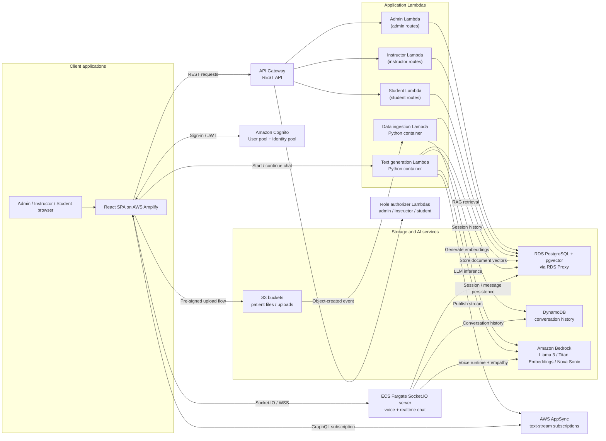
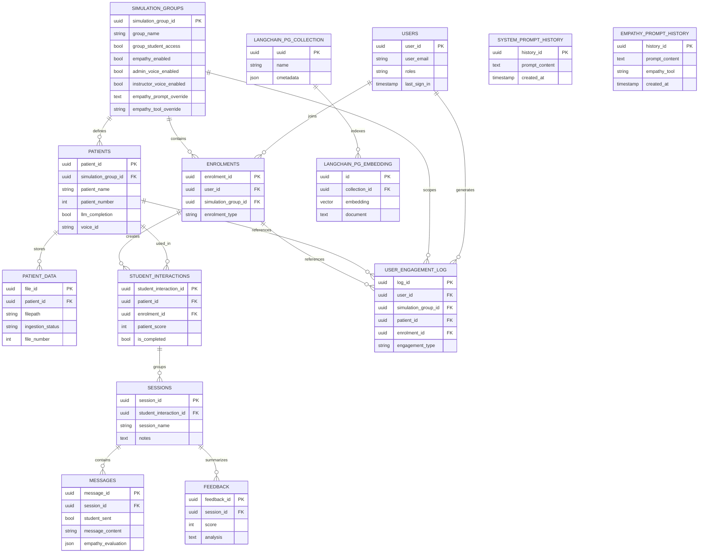

# Architecture Deep Dive

## Architecture



## Description

1. The React frontend is hosted on AWS Amplify and authenticates users with Amazon Cognito.
2. Browser clients call the REST API through API Gateway, which delegates role checks to dedicated admin, instructor, and student authorizer Lambdas.
3. API Gateway routes business requests to three main backend Lambdas: admin, instructor, and student. Those Lambdas read and write the shared PostgreSQL database through RDS Proxy.
4. Instructors upload patient files through pre-signed S3 URLs. New uploads trigger the data-ingestion Lambda container.
5. The data-ingestion Lambda uses Amazon Bedrock Titan embeddings and stores document vectors in PostgreSQL with pgvector.
6. Student text chat calls the text-generation Lambda container, which combines RDS/pgvector retrieval with Amazon Bedrock Llama 3 inference.
7. Conversation history is maintained in DynamoDB for LangChain chat memory, while relational application data such as sessions and messages remains in PostgreSQL.
8. Generated text is streamed back to the frontend through AWS AppSync subscriptions.
9. Realtime voice conversations use the Socket.IO server running on ECS Fargate, which coordinates Bedrock Nova Sonic, DynamoDB-backed history, and RDS-backed session persistence.

## Database Schema



Standalone tables such as `system_prompt_history` and `empathy_prompt_history` are configuration history stores rather than part of the main relational workflow chain. `langchain_pg_collection` and `langchain_pg_embedding` are the pgvector-backed retrieval tables used by document ingestion and RAG.

### RDS Langchain Tables

### `langchain_pg_collection` table

| Column Name | Description                    |
| ----------- | ------------------------------ |
| `uuid`      | The uuid of the collection     |
| `name`      | The name of the collection     |
| `cmetadata` | The metadata of the collection |

### `langchain_pg_embedding` table

| Column Name     | Description                           |
| --------------- | ------------------------------------- |
| `id`            | The ID of the embeddings              |
| `collection_id` | The uuid of the collection            |
| `embedding`     | The vector embeddings of the document |
| `cmetadata`     | The metadata of the collection        |
| `document`      | The content of the document           |

### RDS PostgreSQL Tables

### `users` table

| Column Name            | Description                             |
| ---------------------- | --------------------------------------- |
| `user_id`              | The ID of the user                      |
| `user_email`           | The email of the user                   |
| `username`             | The username of the user                |
| `first_name`           | The first name of the user              |
| `last_name`            | The last name of the user               |
| `preferred_name`       | The preferred name of the user          |
| `time_account_created` | The time the account was created in UTC |
| `roles`                | The roles of the user                   |
| `last_sign_in`         | The time the user last signed in in UTC |

### `simulation_groups` table

| Column Name             | Description                                     |
| ----------------------- | ----------------------------------------------- |
| `simulation_group_id`   | The ID of the simulation group                  |
| `group_name`            | The name of the simulation group                |
| `group_description`     | The description of the simulation group         |
| `group_access_code`     | The access code for students to join the group  |
| `group_student_access`  | Whether or not students can access the group    |
| `system_prompt`         | The system prompt for the group                 |

### `enrolments` table

| Column Name                    | Description                                               |
| ------------------------------ | --------------------------------------------------------- |
| `enrolment_id`                 | The ID of the enrolment                                   |
| `user_id`                      | The ID of the enrolled user                               |
| `simulation_group_id`          | The ID of the associated simulation group                 |
| `enrolment_type`               | The type of enrolment (e.g., student, instructor, admin)  |
| `group_completion_percentage`  | The percentage of the group completed (currently unused)  |
| `time_enroled`                 | The timestamp when the enrolment occurred                 |

### `patients` table

| Column Name           | Description                                |
| ---------------       | --------------------------------           |
| `patient_id`          | The ID of the patient                      |
| `simulation_group_id` | The ID of the associated simulation group  |
| `patient_name`        | The name of the patient                    |
| `patient_age`         | The age of the patient                     |
| `patient_gender`      | The gender of the patient                  |
| `patient_number`      | The number of the patient                  |
| `patient_prompt`      | The prompt that reveals more about patient |
| `llm_completion`      | The name of the patient                    |

### `patient_data` table

| Column Name           | Description                                  |
| --------------------- | -------------------------------------------- |
| `file_id`             | The ID of the file                           |
| `patient_id`          | The ID of the associated patient             |
| `filetype`            | The type of the file (e.g., pdf, docx, etc.) |
| `s3_bucket_reference` | The reference to the S3 bucket               |
| `filepath`            | The path to the file in the S3 bucket        |
| `filename`            | The name of the file                         |
| `time_uploaded`       | The timestamp when the file was uploaded     |
| `metadata`            | Additional metadata about the file           |
| `file_number`         | Number of the file to keep track of order    |

### `student_interactions` table

| Column Name                 | Description                                                                                |
| --------------------------  | -------------------------------------------------------                                    |
| `student_interaction_id`    | The ID of the student interaction                                                          |
| `patient_id`                | The ID of the associated patient                                                           |
| `enrolment_id`              | The ID of the related enrolment                                                            |
| `patient_score`             | Score calculated by the LLM for the student interacting with the patient                   |
| `last_accessed`             | The timestamp of the last time the patient was accessed                                    |
| `patient_context_embedding` | A float array representing the patient context embedding                                   |
| `is_completed`              | A Boolean representing if the instructor has marked this student's interaction as complete |

### `sessions` table

| Column Name                  | Description                                                                  |
| ---------------------------- | ---------------------------------------------------------------------------- |
| `session_id`                 | The ID of the session                                                        |
| `student_interaction_id`     | The ID of the associated student interaction                                 |
| `session_name`               | The name of the session                                                      |
| `session_context_embeddings` | A float array representing the session context embeddings (currently unused) |
| `last_accessed`              | The timestamp of the last time the session was accessed                      |
| `notes`                      | The notes a student can take per session when talking to a patient           |

### `messages` table

| Column Name       | Description                                           |
| ----------------- | ----------------------------------------------------- |
| `message_id`      | The ID of the message                                 |
| `session_id`      | The ID of the associated session                      |
| `student_sent`    | Whether the message was sent by the student (boolean) |
| `message_content` | The content of the message (currently unused)         |
| `time_sent`       | The timestamp when the message was sent               |

### `user_engagement_log` table

| Column Name           | Description                                   |
| -----------------     | --------------------------------------------  |
| `log_id`              | The ID of the engagement log entry            |
| `user_id`             | The ID of the user                            |
| `simulation_group_id` | The ID of the associated simulation group     |
| `patient_id`          | The ID of the associated patient              |
| `enrolment_id`        | The ID of the related enrolment               |
| `timestamp`           | The timestamp of the engagement event         |
| `engagement_type`     | The type of engagement (e.g., patient access) |
| `engagement_details`  | The text describing the engagement            |

## S3 Bucket Structure

```
.
├── {simulation_group_id}
    └── {patient_id}
        └── documents
            ├── document_1.pdf
            └── document_2.pdf
        └── info
            ├── info_1.pdf
            └── info_2.pdf
        └── answer_key
            ├── answer_key_1.pdf
        └── profile_pic
            ├── {patient_id}_profile_pic.png

```
