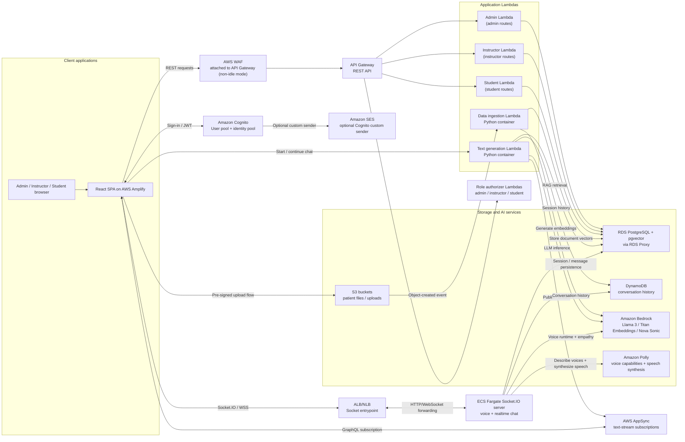
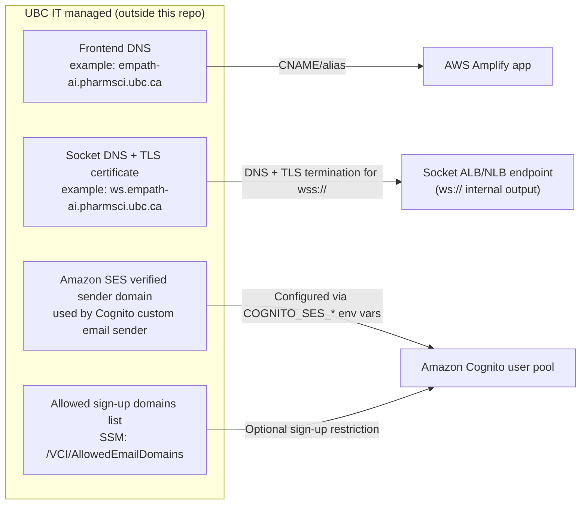
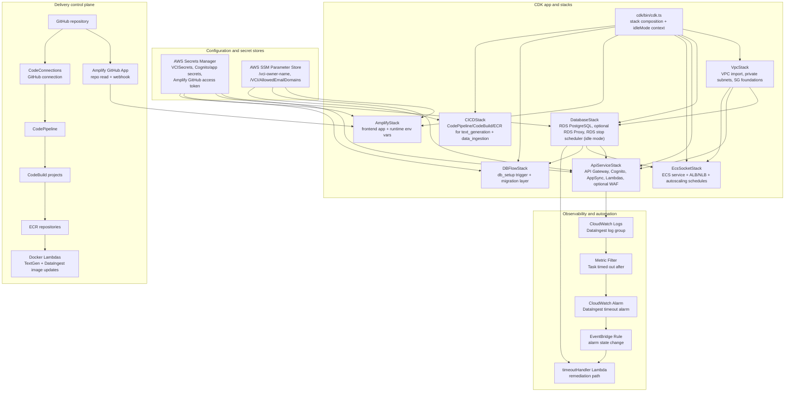
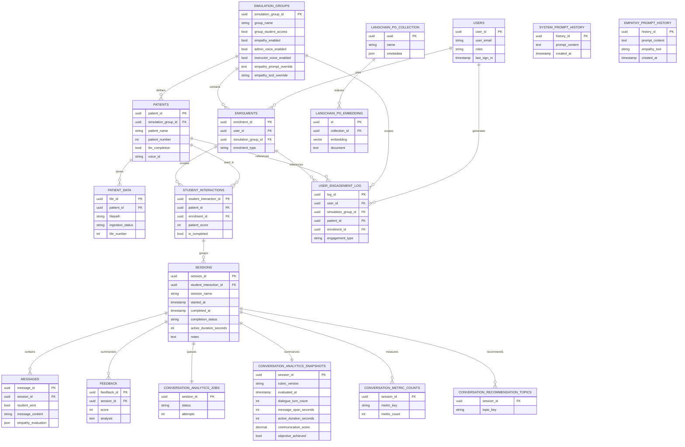

# Architecture Deep Dive

## Architecture



## External Dependencies Managed Outside This Repository (UBC IT)



Notes:
1. The custom Amazon SES sender domain is optional. If SES sender settings are not provided, Cognito uses its default email sender.
2. The allowed sign-up domain list is also environment-specific. Some environments intentionally run Cognito without `/VCI/AllowedEmailDomains` restrictions.

## CDK Control Plane (Infrastructure and Operations Wiring)



This control-plane view covers key CDK-managed components that are intentionally simplified in the runtime diagram:
1. Network and placement control (VPC/subnets/security groups).
2. Secrets/config distribution (Secrets Manager and SSM).
3. Automated operations wiring (CloudWatch + EventBridge + timeout handler).
4. Database migration bootstrap path (DBFlow trigger Lambda).
5. Image build and delivery path for Docker Lambdas (CodePipeline/CodeBuild/ECR).

## Description

1. The React frontend is hosted on AWS Amplify and authenticates users with Amazon Cognito. Cognito can optionally use Amazon SES as a custom email sender.
2. Browser clients call the REST API through AWS WAF (when not in idle mode) and API Gateway, which delegates role checks to dedicated admin, instructor, and student authorizer Lambdas.
3. API Gateway routes business requests to three main backend Lambdas: admin, instructor, and student. Those Lambdas read and write the shared PostgreSQL database through RDS Proxy.
4. Instructors upload patient files through pre-signed S3 URLs. New uploads trigger the data-ingestion Lambda container.
5. The data-ingestion Lambda uses Amazon Bedrock Titan embeddings and stores document vectors in PostgreSQL with pgvector.
6. Student text chat calls the text-generation Lambda container, which combines RDS/pgvector retrieval with Amazon Bedrock Llama 3 inference.
7. Conversation history is maintained in DynamoDB for LangChain chat memory, while relational application data such as sessions and messages remains in PostgreSQL.
8. Generated text is streamed back to the frontend through AWS AppSync subscriptions.
9. Realtime voice conversations use ALB/NLB load balancers in front of the Socket.IO server running on ECS Fargate, which coordinates Bedrock Nova Sonic, Amazon Polly, DynamoDB-backed history, and RDS-backed session persistence. At session start, the voice runtime resolves the selected Polly voice's regional supported engines, prefers generative synthesis, and retries the same voice with universal SSML or plain text when Polly rejects a feature.

## Session Analytics Lifecycle

Each newly created `sessions` row is one learner attempt. The student client records only visible, focused activity in bounded heartbeat increments through `POST /student/record_session_activity`; message timestamps independently provide a first-to-last-message duration.

When the simulation completion signal is received, `POST /student/complete_session` verifies that the authenticated student owns the session, records the immutable terminal lifecycle fields, preserves the existing patient-score behavior, and upserts one pending `conversation_analytics_jobs` row. The student Lambda invokes the text-generation Lambda asynchronously with only the session ID. The worker builds the transcript from RDS, uses the fixed `conversation-analytics-v1` Bedrock tool schema, and writes one versioned snapshot plus normalized metric-count and recommendation-topic rows. Failures restore the job to `pending` and rethrow so Lambda asynchronous retry can process it. Repeated completion calls reuse the same attempt and restart a pending job without reanalyzing completed work.

`GET /instructor/analytics` derives instructor-owned groups from the authenticated identity, rejects an out-of-scope group filter, and returns aggregate-only chart data plus scoped group, patient, and student filter options. It does not return transcript text or model rationales.

## Backend Request Pipeline (Phase 1 Refactor)

The Node.js role routers now share a common request pipeline implementation in `cdk/lambda/lib/shared/requestPipeline.js`.

1. Router handlers resolve route metadata from explicit domain registries (`student/domains.js`, `instructor/domains.js`, `adminFunction/routeDomains.js`).
2. Required query-parameter validation is defined per route in domain metadata rather than duplicated inline in each handler.
3. Instructor/student ownership checks (`email`, `student_email`, `user_email`, `instructor_email`) are enforced centrally before route execution.
4. Typed operational errors in `cdk/lambda/lib/shared/errors.js` standardize status-code mapping and error payload shape.
5. Domain service modules in `cdk/lambda/lib/services/` host shared SQL/business logic for groups, sessions, users, empathy, and voice to reduce route-handler duplication.

## Observability And Operability (Phase 3)

Phase 3 introduces a shared structured logging contract for Node runtime paths and maps those logs to CloudWatch metrics, dashboards, and alert policies.

1. Lambda runtime contract lives in `cdk/lambda/lib/shared/logger.js`; socket runtime contract lives in `cdk/socket-server/logger.js`. Both expose the same interface (`createLogger`, `child`, `debug`, `info`, `warn`, `error`) and honor `LOG_LEVEL`/`NODE_LOG_LEVEL` environment controls.
2. The shared request pipeline (`cdk/lambda/lib/shared/requestPipeline.js`) now emits structured request lifecycle events with correlation fields: `requestId`, `role`, `route`, `sessionId`, `durationMs`, and `errorCode`.
3. Socket runtime paths (`cdk/socket-server/server.js`, `cdk/socket-server/novaOutputProcessor.js`) emit structured operational events for authentication outcomes, text-stream starts/errors, disconnects, voice session lifecycle, and DB configuration failures.
4. API stack monitoring (`cdk/lib/constructs/monitoring.ts`) now derives Lambda request/error/DB-connection metrics from structured logs, adds an ops dashboard, and creates SLO-aligned alarms (SEV2/SEV3 tags in alarm descriptions).
5. Socket stack monitoring (`cdk/lib/ecs-socket-stack.ts`) now derives streaming-failure, disconnect-spike, and DB-connection metrics from socket structured logs, plus error-budget burn indicators aligned to a 99.5% stream-success SLO.

## Database Schema



Standalone tables such as `system_prompt_history` and `empathy_prompt_history` are configuration history stores rather than part of the main relational workflow chain. `langchain_pg_collection` and `langchain_pg_embedding` are the pgvector-backed retrieval tables used by document ingestion and RAG.

### RDS Langchain Tables

### `langchain_pg_collection` table

| Column Name | Description                    |
| ----------- | ------------------------------ |
| `uuid`      | The uuid of the collection     |
| `name`      | The name of the collection     |
| `cmetadata` | The metadata of the collection |

### `langchain_pg_embedding` table

| Column Name     | Description                           |
| --------------- | ------------------------------------- |
| `id`            | The ID of the embeddings              |
| `collection_id` | The uuid of the collection            |
| `embedding`     | The vector embeddings of the document |
| `cmetadata`     | The metadata of the collection        |
| `document`      | The content of the document           |

### RDS PostgreSQL Tables

### `users` table

| Column Name            | Description                             |
| ---------------------- | --------------------------------------- |
| `user_id`              | The ID of the user                      |
| `user_email`           | The email of the user                   |
| `username`             | The username of the user                |
| `first_name`           | The first name of the user              |
| `last_name`            | The last name of the user               |
| `preferred_name`       | The preferred name of the user          |
| `time_account_created` | The time the account was created in UTC |
| `roles`                | The roles of the user                   |
| `last_sign_in`         | The time the user last signed in in UTC |

### `simulation_groups` table

| Column Name             | Description                                     |
| ----------------------- | ----------------------------------------------- |
| `simulation_group_id`   | The ID of the simulation group                  |
| `group_name`            | The name of the simulation group                |
| `group_description`     | The description of the simulation group         |
| `group_access_code`     | The access code for students to join the group  |
| `group_student_access`  | Whether or not students can access the group    |
| `system_prompt`         | The system prompt for the group                 |

### `enrolments` table

| Column Name                    | Description                                               |
| ------------------------------ | --------------------------------------------------------- |
| `enrolment_id`                 | The ID of the enrolment                                   |
| `user_id`                      | The ID of the enrolled user                               |
| `simulation_group_id`          | The ID of the associated simulation group                 |
| `enrolment_type`               | The type of enrolment (e.g., student, instructor, admin)  |
| `group_completion_percentage`  | The percentage of the group completed (currently unused)  |
| `time_enroled`                 | The timestamp when the enrolment occurred                 |

### `patients` table

| Column Name           | Description                                |
| ---------------       | --------------------------------           |
| `patient_id`          | The ID of the patient                      |
| `simulation_group_id` | The ID of the associated simulation group  |
| `patient_name`        | The name of the patient                    |
| `patient_age`         | The age of the patient                     |
| `patient_gender`      | The gender of the patient                  |
| `patient_number`      | The number of the patient                  |
| `patient_prompt`      | The prompt that reveals more about patient |
| `llm_completion`      | The name of the patient                    |

### `patient_data` table

| Column Name           | Description                                  |
| --------------------- | -------------------------------------------- |
| `file_id`             | The ID of the file                           |
| `patient_id`          | The ID of the associated patient             |
| `filetype`            | The type of the file (e.g., pdf, docx, etc.) |
| `s3_bucket_reference` | The reference to the S3 bucket               |
| `filepath`            | The path to the file in the S3 bucket        |
| `filename`            | The name of the file                         |
| `time_uploaded`       | The timestamp when the file was uploaded     |
| `metadata`            | Additional metadata about the file           |
| `file_number`         | Number of the file to keep track of order    |

### `student_interactions` table

| Column Name                 | Description                                                                                |
| --------------------------  | -------------------------------------------------------                                    |
| `student_interaction_id`    | The ID of the student interaction                                                          |
| `patient_id`                | The ID of the associated patient                                                           |
| `enrolment_id`              | The ID of the related enrolment                                                            |
| `patient_score`             | Score calculated by the LLM for the student interacting with the patient                   |
| `last_accessed`             | The timestamp of the last time the patient was accessed                                    |
| `patient_context_embedding` | A float array representing the patient context embedding                                   |
| `is_completed`              | A Boolean representing if the instructor has marked this student's interaction as complete |

### `sessions` table

| Column Name                  | Description                                                                  |
| ---------------------------- | ---------------------------------------------------------------------------- |
| `session_id`                 | The ID of the session                                                        |
| `student_interaction_id`     | The ID of the associated student interaction                                 |
| `session_name`               | The name of the session                                                      |
| `session_context_embeddings` | A float array representing the session context embeddings (currently unused) |
| `last_accessed`              | The timestamp of the last time the session was accessed                      |
| `started_at`                 | The time the learner started this attempt                                    |
| `last_activity_at`           | The latest recorded focused activity                                         |
| `active_duration_seconds`    | Accumulated visible and focused browser time                                 |
| `completed_at`               | The time this attempt was completed                                          |
| `completion_status`          | Whether the attempt is in progress, completed, or abandoned                  |
| `completion_reason`          | The terminal completion reason when supplied                                 |
| `notes`                      | The notes a student can take per session when talking to a patient           |

### `messages` table

| Column Name       | Description                                           |
| ----------------- | ----------------------------------------------------- |
| `message_id`      | The ID of the message                                 |
| `session_id`      | The ID of the associated session                      |
| `student_sent`    | Whether the message was sent by the student (boolean) |
| `message_content` | The content of the message (currently unused)         |
| `time_sent`       | The timestamp when the message was sent               |

### `user_engagement_log` table

| Column Name           | Description                                   |
| -----------------     | --------------------------------------------  |
| `log_id`              | The ID of the engagement log entry            |
| `user_id`             | The ID of the user                            |
| `simulation_group_id` | The ID of the associated simulation group     |
| `patient_id`          | The ID of the associated patient              |
| `enrolment_id`        | The ID of the related enrolment               |
| `timestamp`           | The timestamp of the engagement event         |
| `engagement_type`     | The type of engagement (e.g., patient access) |
| `engagement_details`  | The text describing the engagement            |

### Conversation Analytics Tables

`conversation_analytics_jobs` records one durable terminal-analysis job per session. `conversation_analytics_snapshots` stores the versioned outcome of that analysis. `conversation_metric_counts` stores the fixed publication-oriented communication measures, and `conversation_recommendation_topics` stores controlled coaching-topic keys. These tables contain aggregate-ready keys and counts; instructor reporting must not use transcript text or unaggregated model rationales.

## S3 Bucket Structure

```
.
├── {simulation_group_id}
    └── {patient_id}
        └── documents
            ├── document_1.pdf
            └── document_2.pdf
        └── info
            ├── info_1.pdf
            └── info_2.pdf
        └── answer_key
            ├── answer_key_1.pdf
        └── profile_pic
            ├── {patient_id}_profile_pic.png

```
